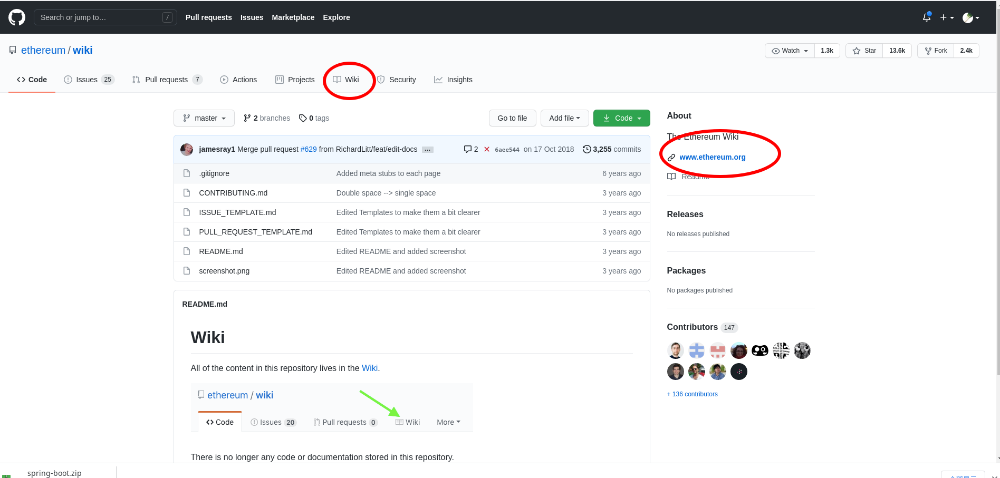
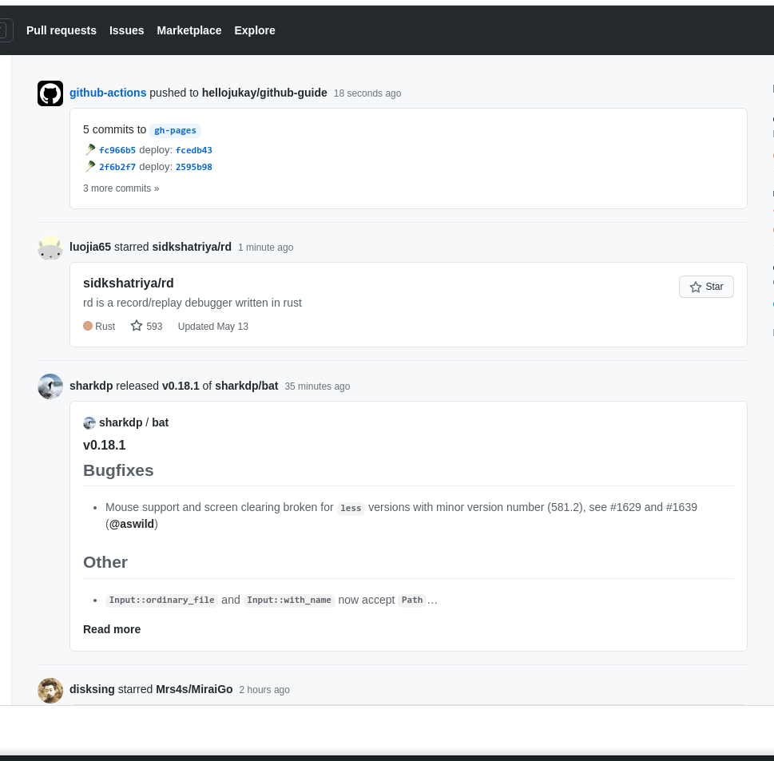

# github 工作流

# 使用项目
## 快速找到项目
### 搜索技巧
## 项目文档
很多的开源项目都会有文档页面，有的可能是 github 上的 wiki 页，有的可能是一个单独的网址，如果是一个单独的网址，一般在项目中会标注网址。

还有的项目会提供一些示例的代码或者用法

## 解决问题
## 关注进展
我们关注一些项目以后，这个项目的相关事件就会在我们的首页出现

# 贡献代码
大家都是如何基于 github 运作开源项目的,我们如何向开源项目共享代码。大概经历如下几个步骤：

* 因为某某原因，你需要向某个仓库
* 你在 Pull requests` 和 `issue` 里面确认了没有人在类似的事情
* 你浏览了该项目的 contributor-guide.md, 了解这个项目的开发规则 
* 你将自己明显的仓库 clone 到本地，完成了开发和测试
* 将自己开发的代码通过 `Pull requests` 的方式请求合并到原始仓库
* 开源仓库的负责人review 了你的代码之后，确认没有问题给了一个大大赞，并且在 `Pull requests`下回复`TLGM`等字样，如果你没有通过 review, 他们会通知你整改
* 项目负责人合并了你的代码

### Fork

### Pull requests

